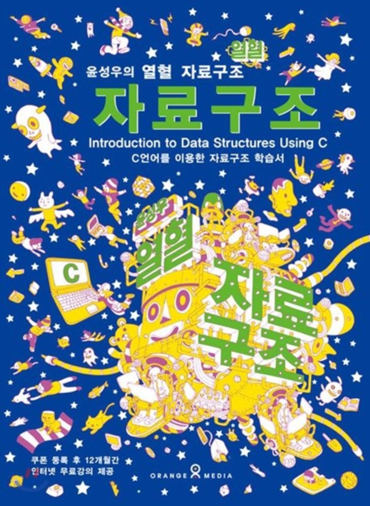

윤성우의 열혈 자료구조
=====================
저자 윤성우
-----------



### Chapter 01. 자료구조와 알고리즘의 이해
- - -
```
01-1. 자료구조(Data Structure)에 대한 기본적인 이해
01-2. 알고리즘의 성능분석 방법
프로그래밍 문제의 답안
```

### Chapter 02. 재귀(Recursion)
- - -
```
02-1. 함수의 재귀적 호출의 이해
02-2. 재귀의 활용
02-3. 하노이 타워: The Tower of Hanoi
```
